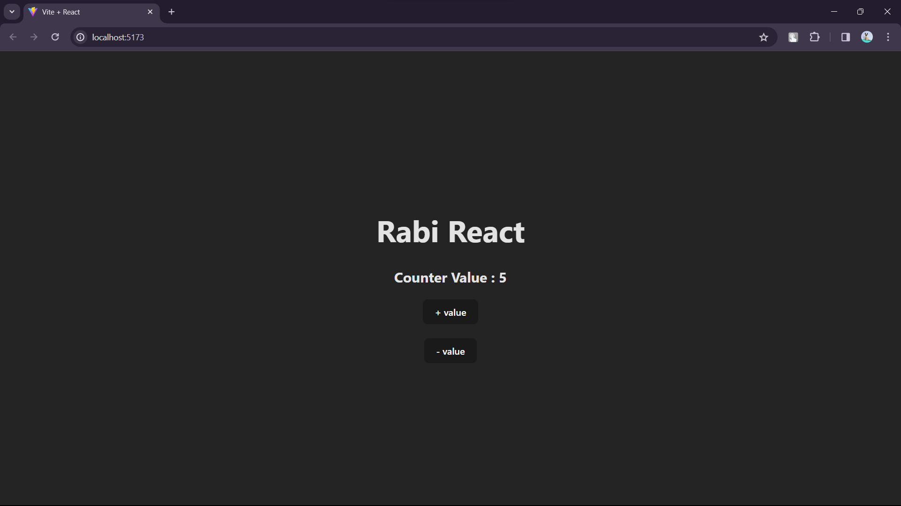

# Counter Project

## Description
The Counter Project is a simple web application where users can increase or decrease a counter by pressing buttons. When the plus button is pressed, the counter increases by 1, and when the minus button is pressed, the counter decreases by 1.

## Features
- Simple user interface
- Usage of React useState hook for managing state

## Technologies Used
- React.js

## What did i learn? 

> usage of react hook 

- somethinh tasadsaklasd

## Project Images :

